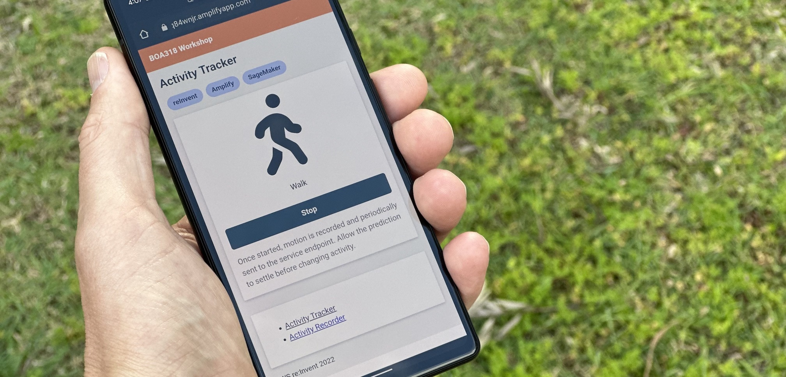

# Build a fitness activity tracker using machine learning on AWS

*This project repository has been adapted from an AWS workshop of the same name.*

## Project Outline

This project deploys a mobile web app, that uses a machine learning model you train, to detect activities you're doing.

The app itself is deployed using AWS Amplify, and the machine learning model is trained and hosted with Amazon SageMaker.

## Deployment

### Amplify 

Deploy the web app:
- In the AWS Console, navigate to AWS Amplify. 
- Create a new app. 
- Select this GitHub repository as the source of the app. 
- From the mono-repo config, select the `amplify-app` folder.
- Deploy both the front and backend.

### SageMaker

Load the notebook:
- Clone this repository (or just the SageMaker folder) into Amazon SageMaker Studio.
- Step through the code in the notebook. 

### Charges and Quotas

Aspects of this project will incur a charge.  Before deploying any element of this project
please check the AWS pricing pages for the relevant services before deploying. For more information about AWS service pricing, see [here](https://aws.amazon.com/pricing).

Code in this project will make calls to run infrastructure in Amazon SageMaker.  In some cases, 
such as brand new accounts, you may find that the quota levels of the account prevent the deployment
of this project.  Check the current quota levels of your AWS account, and request quota limit raises as you need.  For more information about AWS service quotas, see [here](https://docs.aws.amazon.com/general/latest/gr/aws_service_limits.html).

## Security

See [CONTRIBUTING](CONTRIBUTING.md#security-issue-notifications) for more information.

## License

This library is licensed under the MIT-0 License. See the LICENSE file.

